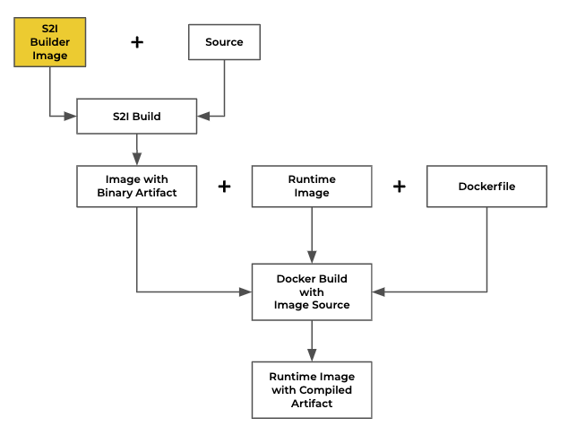

# Custom maven S2I Image Builder for OpenShift

 Here you will find everything to build the custom maven **S2I Builder Image** (yellow box). In addition we will go through the whole the process of setting up a proper chained build process visualized by the graphic below and deploy the resulting minimal image containing our artefact and runtime in our OpenShift / OKD cluster. 

We will show case the benefits of a custom S2I builder image. Our builder image will be able to build java based git repositories from source with maven if a pom.xml is found. We will base our example on the hello world application provided by [wildlfy/quickstart](https://github.com/wildfly/quickstart). In addition we will briefly go through the benefits of using so called chained builds.

<p align="center">

</p>

---

## Use Case Scenario

We have our application source code available in a git repository ([wildlfy/quickstart](https://github.com/wildfly/quickstart)) and we would like to containerize the application and run it with Wildfly as our runtime in OpenShift or OKD. 

**Main objective**
* create an image that can run our application
* reduce image size to minimize transfer and deployment time
* source code is not allowed to be part of the final image
* no unnecessary packages are allowed to keep the potential attack surface minimal
* container needs to be capable to run with a random UID (no root in runtime image allowed)

**Bonus objective**
* the faster we can build the happier is our user base <br>
* robust builds: if we can't build fast we should at least be able to build

**Our restrictions**
* we are not allowed to alter any elements in the source code repository <br>

**Prerequisits**
* access to an OpenShift or OKD cluster

---

### Implementation 1: Satisfy Main Objective

#### 1) Create a new project
Create a new project in OpenShift to store our custom **S2I Image Builder** image and our application

```
oc new-project mys2i --display-name="Wildfly - Hello World" --description="This project holds all our resources to build our custom S2I image builder and to us the custom S2I image builder to compile and run our hello world application"
```

#### 2) create the builder image 
Let's build the builder image from it's repository and name it `s2i-image-builder-maven`. This will create a BuildConfig and an ImageStream called `s2i-image-builder-maven` and trigger the the first build of our custom **S2I Image Builder** image called `s2i-image-builder-maven`. <br> 
**Hint:** `#1.0.0` at the end of the repository url specifies a tag or branch. If nothing is specified master will be used.

```
oc new-build https://github.com/ckaserer/openshift-maven#1.0.0 --name=s2i-image-builder-maven
```

#### 3) use the builder to build your artefact
Now we have got our first component in place: our custom **S2I Image Builder** `s2i-image-builder-maven`. Next we will use our newly created builder image to build our hello world application artefact from source. 

**Pitfall -> ContextDir:** Since our hello world application has its `pom.xml` in `helloworld/pom.xml` we could set `contextDir=helloworld`. However, `helloworld/pom.xml` refers to a `pom.xml` which resides in its parent directory. Here we got an issue with the implementation of **contextDir**. As specified in the OpenShift 4.2 documentation (https://docs.openshift.com/container-platform/4.2/builds/creating-build-inputs.html):

> any input content that resides outside of the **contextDir** will be ingored by the build. 

That translates to `../pom.xml` not found for us, since it resides outside of the specified **contextDir**.

For this reason our custom build image has an additional environment variable that does not have the above mentioned limitation.

In short we will use our `s2i-image-builder-maven` to build wildfly/quickstart tagged 18.0.0.Final and call it `binary-artefact`. Since our application `pom.xml` resides in `helloworld/pom.xml` we will use the environment variable **CONTEXT_DIR** to set our context directory. In addition we will set our **MAVEN_OPTS** to use the openshift profile specified in the `pom.xml`.

```
oc new-build s2i-image-builder-maven~https://github.com/wildfly/quickstart#18.0.0.Final \
     --name=binary-artefact  \
     --env=CONTEXT_DIR=helloworld \
     --env MAVEN_OPTS="-P openshift"
```

#### 4) Combine artefact with runtime
Now we have an image called `binary-artefact` that contains our application war in `/deployments/helloworld/target/ROOT.war`. To combine our artefact with a runtime environment we will copy the artefact from the `binary-artefact` image to our new `runtime` image that we build via an inline specified dockerfile.

```
oc new-build --name=runtime --docker-image=jboss/wildfly \
     --source-image=binary-artefact \
     --source-image-path=/deployments/helloworld/target/ROOT.war:. \
     --dockerfile=$'FROM jboss/wildfly\nCOPY ROOT.war /opt/jboss/wildfly/standalone/deployments/ROOT.war'
```

#### 5) Deploy your application
The heavy lifting is done. We have created our final image called `runtime`. Next we want to deploy it as `hello-world`.

```
oc new-app runtime --name=hello-world
```

#### 6) Expose your application
In order to access our application from outside the cluster we still need to expose our `hello-world` sevice via a route.

```
oc expose svc/hello-world
```

#### 7) Access your application
You can now access your application through your browser by entering the url that the `oc expose` command created.

---

### Implementation 2: Satisfy Main Objective + Bonus Objective

In order to archive our bonus objectives we need to build and deploy our application faster. This can easily be done by mirroring the required build dependenciesthat the maven build would typically fetch from maven central in our infrastructure.

For this we will need a Nexus or another product with the capability to proxy the required remote repositories already set up.

To bring our `binary-artefact` build up to speed we can set our own maven mirror(s) via a dedicated environment variable. In short we **replace step 3 from Implementation 1** with

```
oc new-build builder~https://github.com/ckaserer/quickstart#18.0.0.Final \
     --name=binary-artefact \
     --env=MVN_MIRROR="*|https:/my-maven-mirror/path/to/maven-public/" \
     --env=MVN_MIRROR_ALLOW_FALLBACK=true
```

Note that you can speecify multiple maven mirrors via the `MVN_MIRROR` variable. More information on how to do that can be found in the section **Available Environment Variables in Costom Builder**.

**Hint:** we have introduced an additional environment variable `MVN_MIRROR_ALLOW_FALLBACK` which can be set to `true` or `false`. If set to `false` the build will fail if the specified mirror is unavailable. `true` on the other hand will fall back to the repositories specified in the pom.xml and build slowly instead. 

---

## Available Environment Variables in Costom Builder

**MVN_OPTIONS** ... can be used to add additional option to the maven execution. <br>

```
MVN_OPTIONS="-DskipTests"
```

**CONTEXT_DIR** ... can be used to define the location of the pom file within the git repository 
                    when the entire folder structure of the repository is required. Otherwise use 
                    contextDir in your buildconfig. e.g. to use helloworld/pom.xml you can set

```
CONTEXT_DIR=helloworld
```

**MVN_MIRROR**  ... can be used to specify maven mirror repositories <br>
                    a maven repository mirroring all required dependencies can be specified via: 
                    
```
*|http:/my-mirror.com/path/to/repo
```

multiple mirrors can be specified such that mirror-A is used for central and 
mirror-B is used for jboss: 

```
central|http:/mirror-A/path/to/repo;jboss|http:/mirror-B/path/to/repo
```

**MVN_MIRROR_ALLOW_FALLBACK** ... `true` / `false`; default is `false` <br>
                                  `false` ... fail if mirror is unavailable <br>
                                  `true`  ... fall back to maven repositories specified in pom.xml if 
                                              mirror is unavailable

---

## Sources
* https://blog.openshift.com/chaining-builds/
* https://dzone.com/articles/how-to-create-a-builder-image-with-s2i
* https://maven.apache.org/guides/mini/guide-mirror-settings.html
* https://docs.openshift.com/container-platform/4.2/builds/creating-build-inputs.html
